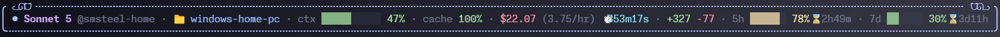

# Claude Code Status Line

A boxed, Catppuccin Mocha-themed status line for Claude Code. Shows model, effort
level, hostname, directory (with drift-from-project-root indicator), git branch,
context usage, cache hit rate, cost (with burn rate), lines changed, and 5h/7d rate
limits — all in an adaptive box that degrades gracefully as the terminal narrows.



## Setup on a new machine

Requirements: Node.js and Git on PATH. Works in Git Bash / WSL on Windows and native
bash on Linux/macOS.

```bash
git clone https://github.com/sm-steel/claude-code-statusline.git ~/.claude-statusline-repo
cd ~/.claude-statusline-repo
bash setup.sh
```

That's it — `setup.sh`:

1. Symlinks `~/.claude/statusline.mjs` and `~/.claude/hooks/check-update.mjs` to
   their repo copies (falls back to a plain copy if symlinks aren't available — see
   below)
2. Merges the `statusLine` config and the update-check hook into
   `~/.claude/settings.json`, without touching any other settings or hooks already
   there
3. Regenerates the local `VERSION` file

Send a new message in Claude Code (or restart it) and the status line appears.

### Windows symlink note

Creating a symlink on Windows needs either **Developer Mode** enabled (Settings >
Privacy & security > For developers) or running the script as Administrator. Without
either, `setup.sh` falls back to a plain copy and tells you so — in that case you'll
need to re-run `setup.sh` after each update instead of it applying automatically.

## Updating

Re-run the same script on any machine — it pulls the latest and re-applies the
symlink/settings merge (safe to run repeatedly):

```bash
cd ~/.claude-statusline-repo && bash setup.sh
```

If your machine has a real symlink (not the copy fallback), a plain `git pull` in the
repo is actually enough on its own — the running script picks up changes immediately
since `~/.claude/statusline.mjs` *is* the repo file, not a copy of it.

## Checking your version

There's no separate version number — the git commit itself is the version, so it
always changes automatically with every commit, nothing to bump manually. To see
what's installed:

```bash
cat ~/.claude-statusline-repo/VERSION
```

(regenerated by `setup.sh` on every run; not tracked in git, purely for glancing at
locally).

## Automatic update checks

A background hook (`hooks.SessionStart` in `settings.json`, wired up by `setup.sh`)
checks at most once every 24 hours whether `origin/main` has moved ahead of your
local clone. It runs fully in the background — it never delays starting a session —
and stays completely silent unless an update is actually available, in which case
Claude will let you know and ask before doing anything. Answering yes just re-runs
`bash ~/.claude-statusline-repo/setup.sh`; nothing is ever applied automatically.

- Override the check interval: `STATUSLINE_UPDATE_CHECK_INTERVAL_HOURS=6` (env var)
- Force an immediate re-check: delete `~/.claude/statusline-update-check.json`
